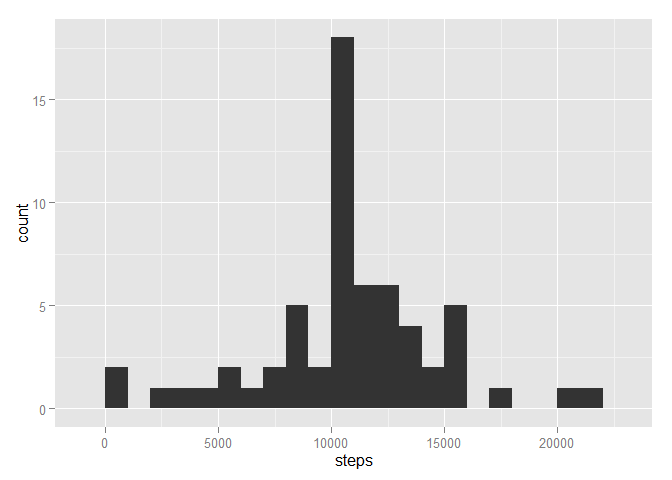
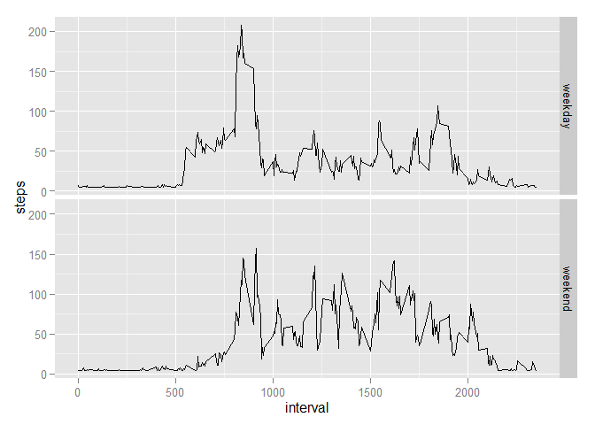

# Reproducible Research: Peer Assessment 1


## Loading and preprocessing the data

```r
if(!file.exists('activity.csv')){
    unzip('activity.zip')
}
```

```r
data <- read.csv("activity.csv", header = TRUE, sep = ",", stringsAsFactor = FALSE)
```
## What is mean total number of steps taken per day?

```r
stepsPerDay <- aggregate(steps ~ date, data, sum)

ggplot(stepsPerDay, aes(steps)) + geom_histogram(binwidth = 1000)
```

 

```r
stepsPerDay_mean <- mean(stepsPerDay$steps, na.rm = TRUE)
stepsPerDay_median <- median(stepsPerDay$steps, na.rm = TRUE)
```

## What is the average daily activity pattern?

```r
avgStepsPerInterval <- aggregate(steps ~ interval, data, mean)

ggplot(avgStepsPerInterval, aes(interval,steps)) + geom_line()
```

 

```r
avgStepsPerInterval$interval[which.max(avgStepsPerInterval$steps)]
```

```
## [1] 835
```

## Imputing missing values

```r
sum(is.na(data))
```

```
## [1] 2304
```

```r
data2 <- data

avgSteps <- mean(data$steps, na.rm = TRUE)

data2[is.na(data2$steps) == TRUE,]$steps <- avgSteps


stepsPerDay2 <- aggregate(steps ~ date, data2, sum)

ggplot(stepsPerDay2, aes(steps)) + geom_histogram(binwidth = 1000)
```

 

```r
mean(stepsPerDay2$steps)
```

```
## [1] 10766.19
```

```r
median(stepsPerDay2$steps)
```

```
## [1] 10766.19
```
## Are there differences in activity patterns between weekdays and weekends?

```r
data2$date <- strptime(data2$date, "%Y-%m-%d")

data2$weekpart <- factor(ifelse(data2$date$wday %in% c(6,0), 'weekend', 'weekday'))

x <- aggregate(steps ~ interval + weekpart, data2, mean)

ggplot(x, aes(interval, steps)) + geom_line() + facet_grid(weekpart ~ .)
```

 
